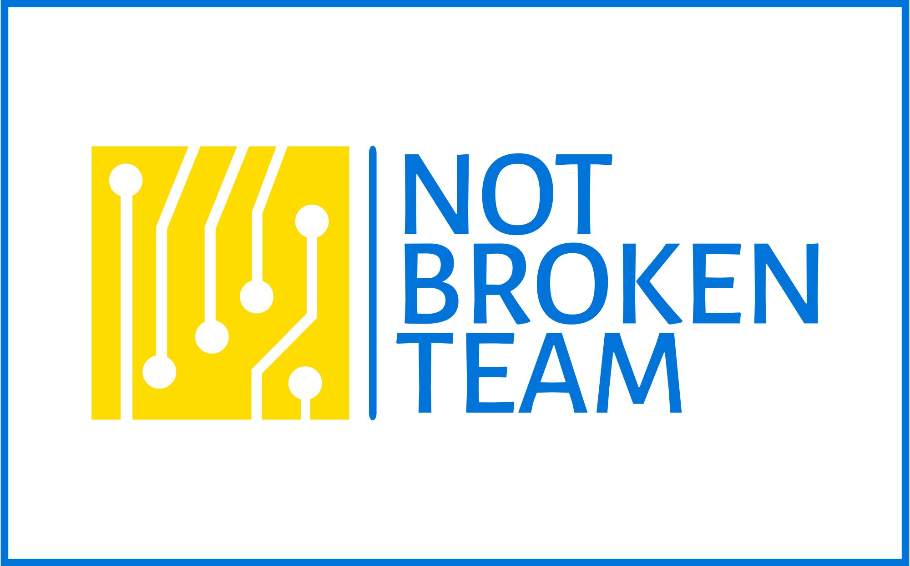
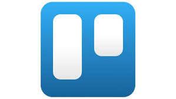

# HealthyHub

HealthyHub is an app designed to make tracking and improving your overall health easier. With HealthyHub you can:
- :muscle: watch your weight
- :runner: track physical activity
- :apple: calorie consumption log
- :droplet: track water consumption.

A convenient and understandable interface allows you to easily enter and view data, as well as set personal goals for achieving a healthy lifestyle. HealthyHub gives you tools to track your progress and prioritize your health.

    <h3 style='margin-right:500px;'>Magic Made by:</h3>
    

Group #10

---
<h2 style="margin-top:80px">Tools and Technologies Used</h2>
<h4>Programming and Markup Languages:</h4>
<table align="center" style="margin-bottom:40px">
  <tr>
    <td align="center" style="border:none">
      <a href="https://developer.mozilla.org/en-US/docs/Web/Guide/HTML/HTML5">
          
          HTML5
      </a>
    </td>
    <td align="center" style="border:none">
      <a href="https://developer.mozilla.org/en-US/docs/Web/CSS">
          
          CSS3
      </a>
    </td>
    <td align="center" style="border:none">
      <a href="https://developer.mozilla.org/en-US/docs/Web/JavaScript">
          
          JavaScript
      </a>
    </td>
     </td>
       <td align="center" style="border:none">
      <a href="https://react.dev/">
          
          React
      </a>
    </td>    
  </tr>
</table>
Development Tools:
<table align="center" style="margin-bottom:40px">
  <tr>
    <td align="center" style="border:none">
      <a href="https://nodejs.org/">
          
          Node.js
      </a>
    </td>
    <td align="center" style="border:none">
      <a href="https://vitejs.dev/">
          
          Vite
      </a>
    </td>
    <td align="center" style="border:none">
      <a href="https://code.visualstudio.com/">
          
          VS Code
      </a>
    </td>
    <td align="center" style="border:none">
      <a href="https://code.visualstudio.com/">
          
          Postman
      </a>
    </td>
  </tr>
</table>
Libraries and Frameworks:
<table align="center" style="margin-bottom:40px">
  <tr>
    <td align="center" style="border:none">
      <a href="https://axios-http.com/">
          
          Axios
      </a>
    </td>
  </tr>
    <tr>
    <td align="center" style="border:none">
      <a href="https://styled-components.com/">
          
          styled components
      </a>
    </td>
  </tr>
</table>
Version Control Systems:
<table align="center" style="margin-bottom:40px">
  <tr>
    <td align="center" style="border:none">
      <a href="https://git-scm.com/">
          
          Git
      </a>
    </td>
    <td align="center" style="border:none">
      <a href="https://github.com/">
          
          GitHub
      </a>
    </td>
  </tr>
</table>
Design and Project Management Tools:
<table align="center">
  <tr>
    <td align="center" style="border:none">
      <a href="https://www.figma.com/">
          
          Figma
      </a>
    </td>
    <td align="center" style="border:none">
      <a href="https://trello.com/">
          
          Trello
      </a>
    </td>
  </tr>
</table>

